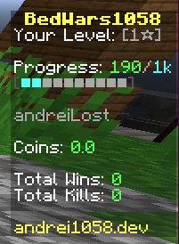

### Sidebar library for Minecraft plugins.
This is a NMS based scoreboard library for Minecraft plugins (spigot, paper).  
[](https://discord.gg/XdJfN2X)

**NOTICE:** Sidebar scores were removed from the right side in sidebar-v_1_20_R3.



### Project structure
This project is divided in several modules:
- `sidebar-base` main API of this library
- `sidebar-v_1_8_R3` will provide support for 1.8.8 (R3)
- `sidebar-v_1_12_R1` provides support for 1.12.2
- `sidebar-v_1_16_R3` provides support for 1.16.5 (R3)
- `sidebar-v_1_17_R1` provides support for 1.17.1
- `sidebar-v_1_18_R1` provides support for 1.18.2 (R2)
- `sidebar-v_1_19_R2` provides support for 1.19.2 (R2)
- `sidebar-v_1_19_R3` provides support for 1.19.4 (R3)
- `sidebar-v_1_20_R1` provides support for 1.20 (R1)
- `sidebar-v_1_20_R2` provides support for 1.20.2 (R2)
- `sidebar-v_1_20_R3` provides support for 1.20.3 (R3)
- `sidebar-v_1_20_R4` provides support for 1.20.4 (R4). Requires `sidebar-v_1_20_R3`.

### IMPORTANT
It is really important to call Sidebar#remove(player) when a player leaves the server to avoid memory leaks.


### How to use
Firs of all make sure to shade `sidebar-base` and the version specific modules in your project. Then use
your `#onEnable` to initialize the sidebar manager like this:

```java
import org.bukkit.Bukkit;
import org.bukkit.plugin.java.JavaPlugin;

public class MyPlugin extends JavaPlugin {

    private static final SidebarManager sidebarManager;

    @Override
    public void onEnable() {
        if (null == (sidebarManager = SidebarManager.init())) {
            // todo server version not supported
            Bukkit.getPluginManager().disablePlugin(this);
        }
    }
    
    public static SidebarManager getSidebarManager() {
        return sidebarManager;
    }
}
```

A sidebar can be sent to several players, but if you have a language-based server or if you want to 
provide player-targeted placeholders you should consider creating a new sidebar instance for each player.  
A sidebar example:

```java
import org.bukkit.ChatColor;

import java.util.ArrayList;

public class MySidebar {

    private Sidebar handle;

    public MySidebar(Player receiver) {
        var title = new SidebarLineAnimated(new String[]{
                ChatColor.RED + "Hello World",
                ChatColor.BLUE + "Hello World"
        });
        
        List<SidebarLine> lines = new ArrayList<>();
        // we add a static line
        lines.add(new SidebarLine() {
            @Override
            public String getLine() {
                return ChatColor.AQUA+"This line does not move";
            }
        });
        // an animated line with a placeholder
        lines.add(new SidebarLineAnimated(new String[]{
                ChatColor.GREEN + "Hello {player}",
                ChatColor.LIGHT_PURPLE + "Hello {player}"
        }));
        
        List<PlaceholderProvider> placeholders = new ArrayList<>();
        placeholders.add(new PlaceholderProvider("{player}", () -> receiver.getDisplayName()));
        
        handle = MyPlugin.getSidebarManager().createSidebar(title, lines, placeholders);
        
        // we can also add placeholders at a later time
        //handle#addPlaceholder
        
        // to add and remove lines use
        //handle#addLine and handle#removeLine
        
        // let's send the scoreboard
        handle.add(receiver);
        
        // if we want another player to see the same sidebar we use handle#add again
        
        // let's format player tab
        var prefix = new SidebarLine() {
            @Override
            public String getLine() {
                return ChatColor.AQUA+"Prefix ";
            }
        };
        var suffix = new SidebarLineAnimated(new String[]{
                ChatColor.GREEN + " ###",
                ChatColor.LIGHT_PURPLE + " ###"
        });
        // users that have been added to this sidebar will see now the tab-format for the given player
        var tabGroup = handle.playerTabCreate("redTeam", receiver, prefix, suffix, PlayerTab.PushingRule.NEVER);
        // we can send the same tab format to other players as well via
        //tabGroup#add
        // this tab group is show only on his sidebar (current). For mini-games such as bed wars we add
        // players from the same team to the same tab group in order to have an ordered tab list.
        // name tag visibility can be changed via
        //tabGroup#setNameTagVisibility
        
        // tab header and footer does is logically detached from the sidebar si you won't need to create
        // a new sidebar to handle header and footer messages in tab
        MyPlugin.getSidebarManager().sendHeaderFooter(player, "PLAY.SERVER.COM", "Be kind!");
        
        // you want to show the player health under his name?
        // this will automatically start showing health for all players
        handle.showPlayerHealth(sidebarLine, showAsWellInTab);
        // hide health with
        handle.hidePlayersHealth();
    }

    public Sidebar getHandle() {
        return handle;
    }
}
```
An example of how you can refresh and manage your sidebar.

```java
import org.bukkit.Bukkit;
import org.bukkit.event.EventHandler;
import org.bukkit.event.Listener;
import org.bukkit.event.player.PlayerJoinEvent;
import org.bukkit.plugin.java.JavaPlugin;

import java.util.ArrayList;

public class MyPlugin extends JavaPlugin implements Listener {

    private static final SidebarManager sidebarManager;
    private static final List<MySidebar> sidebars = new ArrayList<>();

    @Override
    public void onEnable() {
        if (null == (sidebarManager = SidebarManager.init())) {
            // todo server version not supported
            Bukkit.getPluginManager().disablePlugin(this);
        }
        // register join listener
        Bukkit.getPluginManager().registerEvents(this, this);
        
        var titleRefreshInTicks = 10L;
        var linesRefreshInTicks = 20L;
        var healthTextRefreshInTicks = 80L;
        var tabUpdateInTicks = 80L;
        
        Bukkit.getScheduler().runTaskTimer(this, 
                ()-> sb.getHandle().refreshTitle(),
                20L, titleRefreshInTicks
        );
        // will update only animated lines and their placeholders
        Bukkit.getScheduler().runTaskTimer(this,
                ()-> sb.getHandle().refreshAnimatedLines(),
                20L, linesRefreshInTicks
        );
        
        // will refresh placeholders in every sidebar line
        Bukkit.getScheduler().runTaskTimer(this,
                ()-> sb.getHandle().refreshPlaceholders(),
                20L, linesRefreshInTicks
        );
        
        // if enabled, refresh text bellow player name (in case of animated lines)
        // player health amount has to be updated manually
        // Sidebar#setPlayerHealth
        Bukkit.getScheduler().runTaskTimer(this,
                ()-> sb.getHandle().refreshHealthAnimation(),
                20L, healthTextRefreshInTicks
        );
        
        // to refresh tab (player-list) formatting (in case of animated lines)
        Bukkit.getScheduler().runTaskTimer(this,
                ()-> sb.getHandle().playerTabRefreshAnimation(),
                20L, tabUpdateInTicks
        );
    }

    public static SidebarManager getSidebarManager() {
        return sidebarManager;
    }

    @EventHandler
    public void onJoin(PlayerJoinEvent event) {
        // keep trace of our sidebar
        sidebars.add(new MySidebar(event.getPlayer()));
    }
}
```

## Creating a more advanced tab header-footer
```java
// on server start
SidebarManager sidebarHandler = SidebarManager.init();

// tab logic
LinkedList<SidebarLine> headers = new LinkedList<>();
LinkedList<SidebarLine> footers = new LinkedList<>();

headers.add(new SidebarLineAnimated(new String[]{
    ChatColor.RED+"AAAAAAA",
    ChatColor.BLUE+"BBBBBBB"
));
headers.add(new SidebarLine() {@Override
    public @NotNull String getLine() {
        return "This is static";
    }
});

footers.add(new SidebarLineAnimated(new String[]{
    ChatColor.YELLOW+"CCCCCC",
    ChatColor.AQUA+"DDDDDD"
));

LinkedList<PlaceholderProvider> placeholders = new LinkedList<>();
placeholders.add(new PlaceholderProvider("{server}", () -> "andrei1058.dev"));

TabHeaderFooter tab = new TabHeaderFooter(headers, footers, placeholders);

// apply to player
sidebarHandler.sendHeaderFooter(player, tab);

// refresh tabs (apply animations)
Bukkit.getScheduler().runTaskTimer(this, () -> {
    Bukkit.getOnlinePlayers().forEach(player -> {
        sidebarHandler.sendHeaderFooter(player, tab);
    });
}, 1L, 10L);
```

## Experimental
Since 1.20.3 we can replace sidebar score numbers with string placeholders. You can use our experimental feature by implementing **ScoredLine**.

### Maven repository

```xml
<repositories>
    <repository>
        <id>andrei1058-snapshots</id>
        <url>https://repo.andrei1058.dev/snapshots/</url>
    </repository>
    <repository>
        <id>andrei1058-releases</id>
        <url>https://repo.andrei1058.dev/releases/</url>
    </repository>
</repositories>
```

```xml
<dependencies>
    <dependency>
        <groupId>com.andrei1058.spigot.sidebar</groupId>
        <artifactId>sidebar-base</artifactId>
        <version>version-here</version>
        <scope>compile</scope>
    </dependency>
    
    <!-- And based on which versions you want to support compile 
    the listed modules above -->
</dependencies>
```

### License
**LGPL-3.0**  
Created with <3 by Andrei Dascălu (andrei1058)

# Contact
[](https://discord.gg/XdJfN2X)

# Special Thanks To
[](https://www.jetbrains.com)

Jetbrains supports SidebarLib with their [Open Source Licenses](https://www.jetbrains.com/opensource/).

